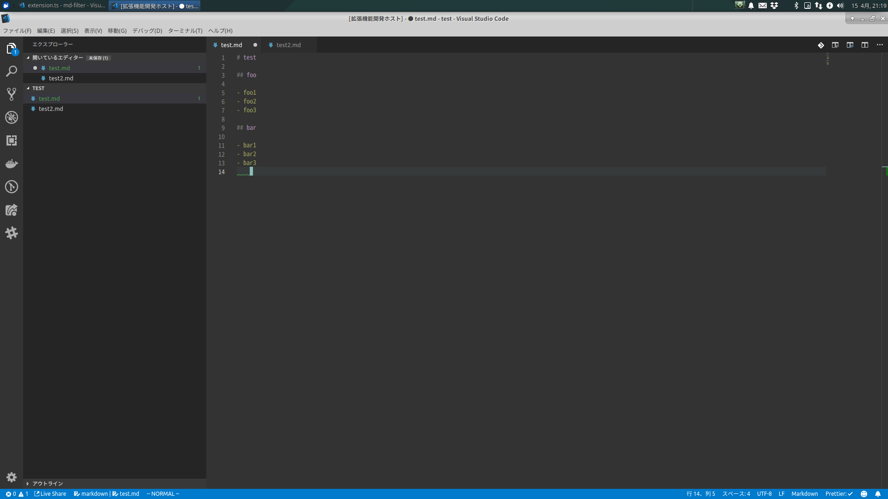
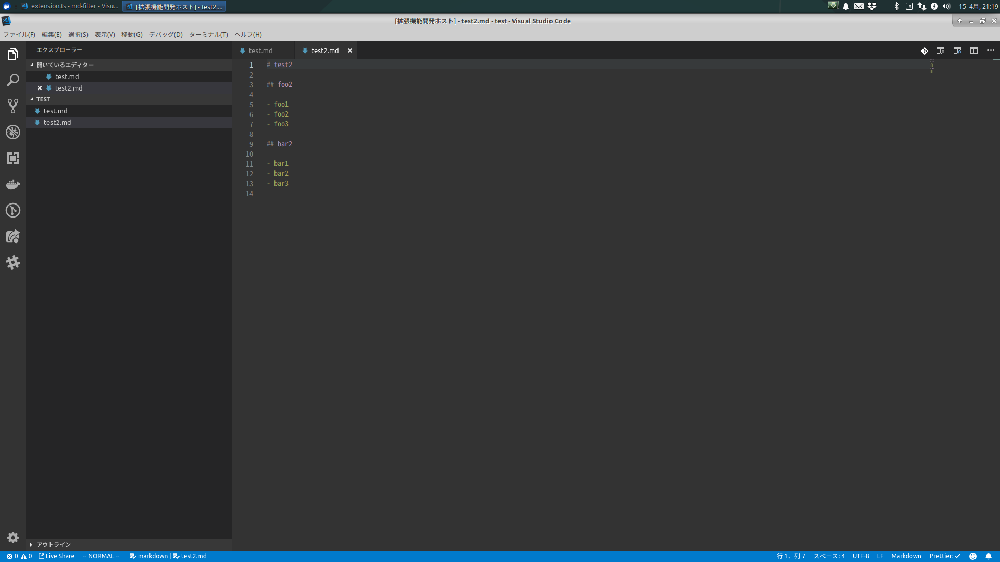
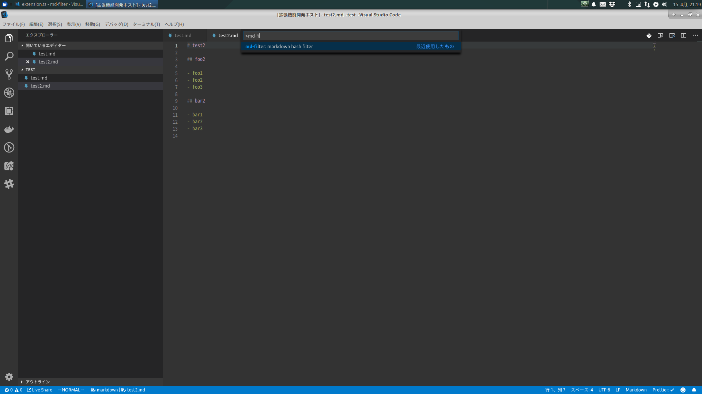
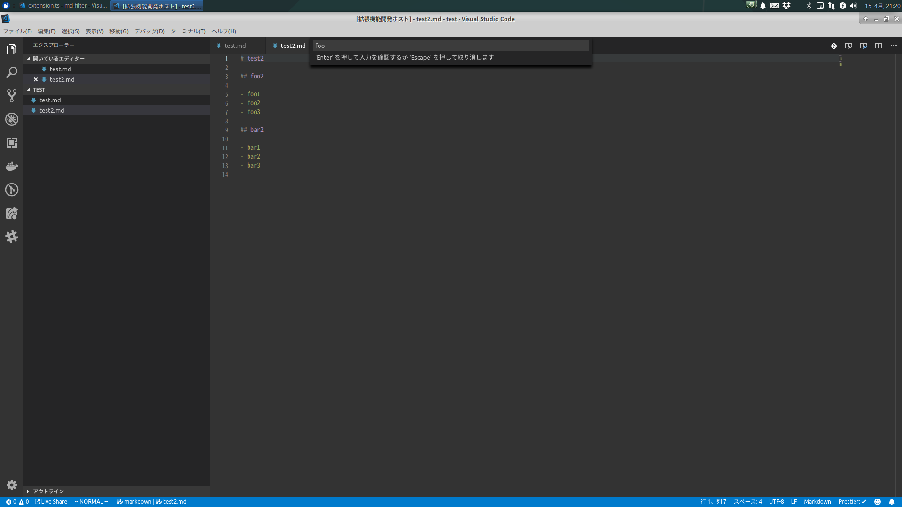
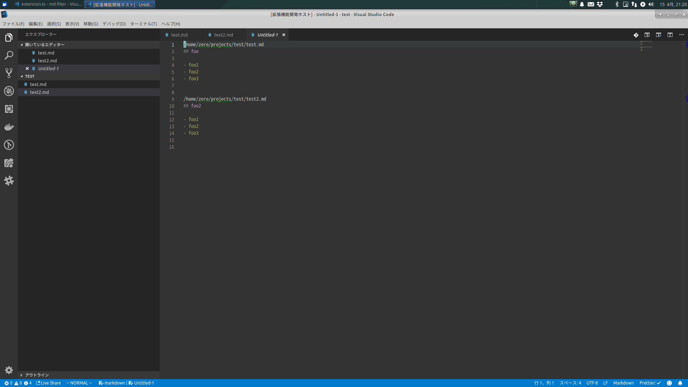

# md-filter README

Filter markdown by hash header.

## Features

Describe specific features of your extension including screenshots of your extension in action. Image paths are relative to this README file.

For example if there is an image subfolder under your extension project workspace:

1. 2. 複数ファイルの markdown の用意

3. コマンドを打つ

4. 絞り込みタグの入力

5. 絞り込まれた出力

## Release Notes

### 0.0.1

Test release
